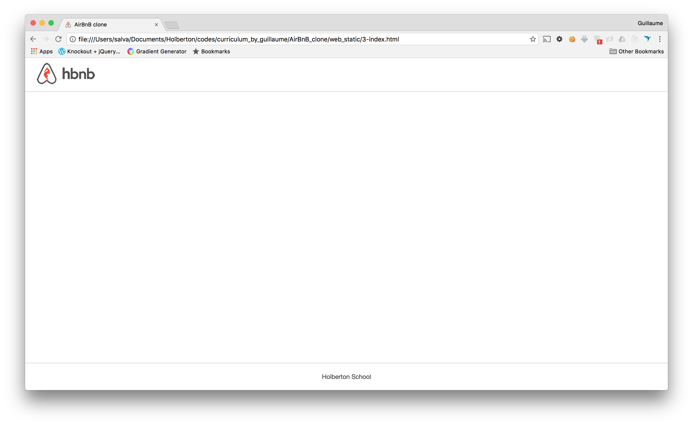
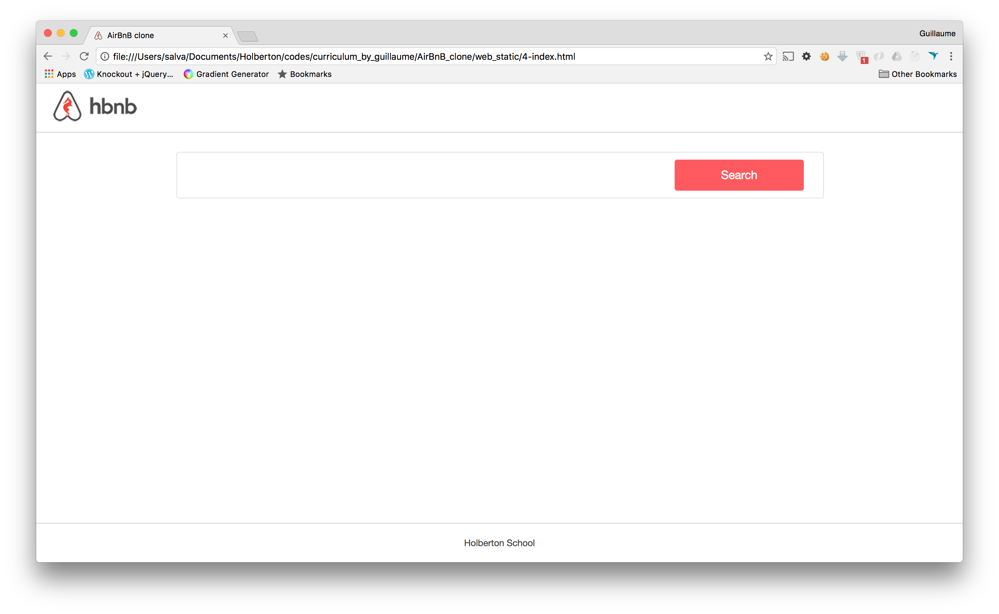
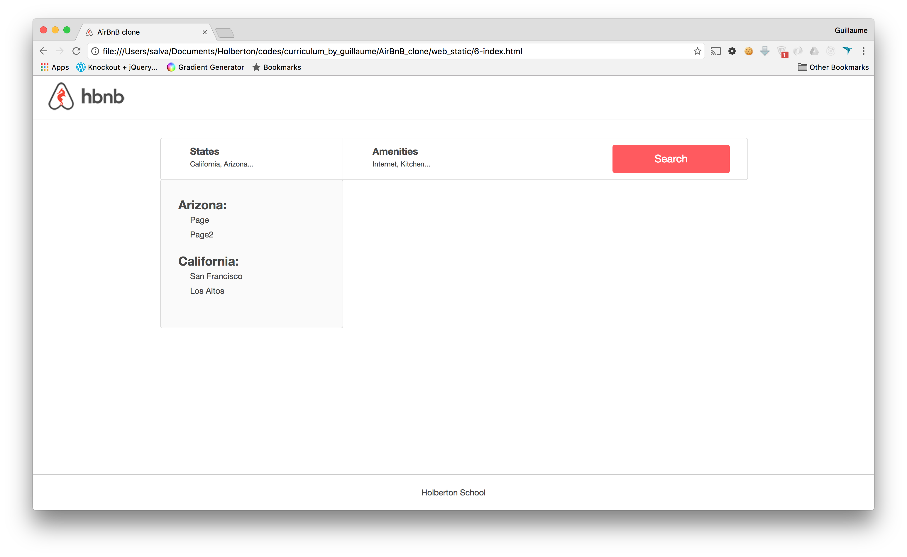
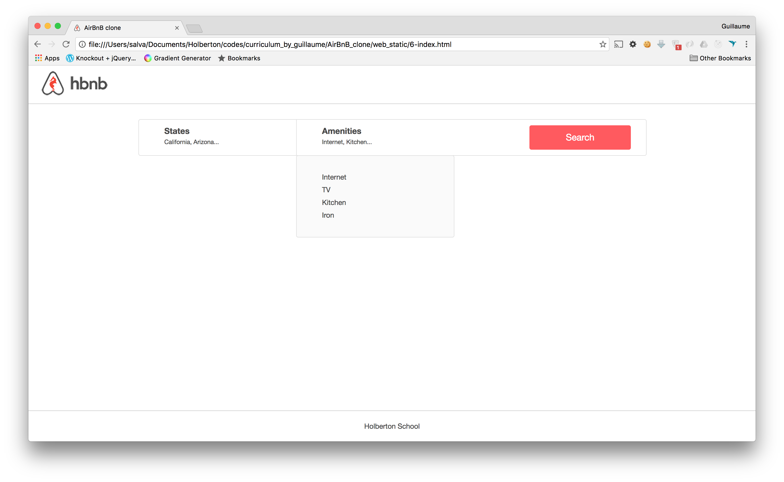

# [AirBnB clone - Web static](https://via.placeholder.com/10/00b48a?text=+)

[Web static, what?](https://via.placeholder.com/10/00b48a?text=+)  
Now that you have a command interpreter for managing your AirBnB objects, it’s time to make them alive!

Before developing a big and complex web application, we will build the front end step-by-step.

The first step is to “design” / “sketch” / “prototype” each element:

    *Create simple HTML static pages 
    *Style guide 
    *Fake contents
    *No Javascript 
    *No data loaded from anything

  

[task 0](https://via.placeholder.com/10/00b48a?text=+)

  

[task 3](https://via.placeholder.com/10/00b48a?text=+)

  

[task 4](https://via.placeholder.com/10/00b48a?text=+)

  

[task 5](https://via.placeholder.com/10/00b48a?text=+)

  

[task 6](https://via.placeholder.com/10/00b48a?text=+)

  
  

[task 7](https://via.placeholder.com/10/00b48a?text=+)

  

[task 8](https://via.placeholder.com/10/00b48a?text=+)

  

## [Authors](https://via.placeholder.com/10/00b48a?text=+)

- [@rania3103](https://www.github.com/rania3103)
